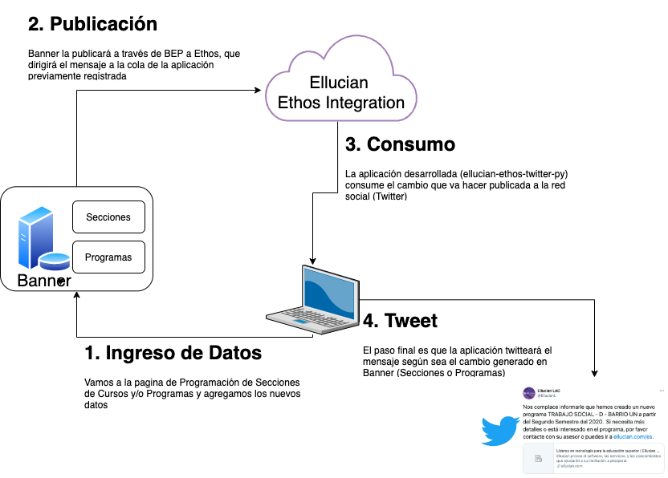
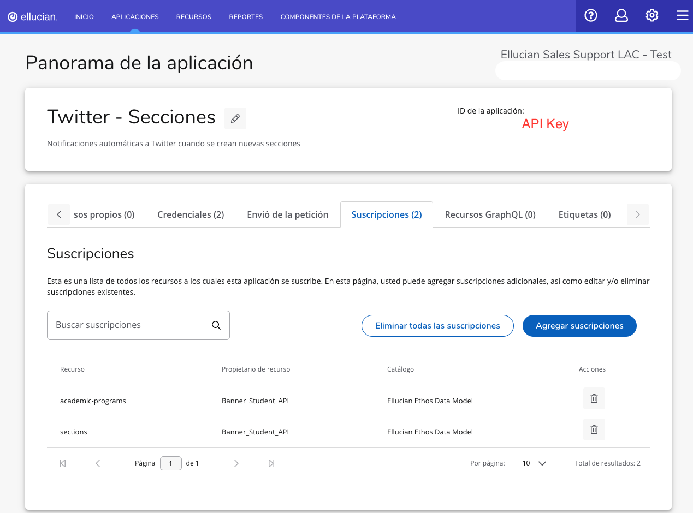
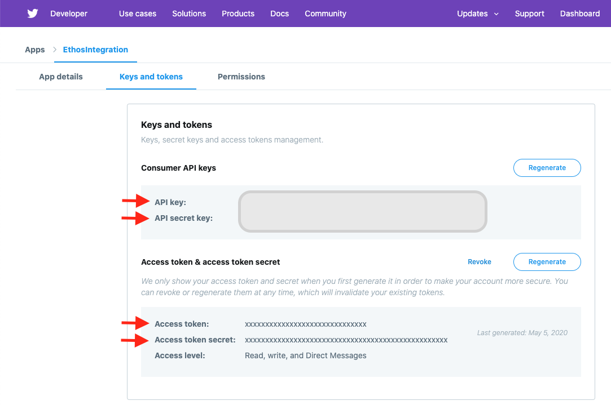

[![Contributors][contributors-shield]][contributors-url]
[![Forks][forks-shield]][forks-url]
[![Stargazers][stars-shield]][stars-url]
[![Issues][issues-shield]][issues-url]
[![Licencia][license-shield]][license-url]
[![LinkedIn][linkedin-shield]][linkedin-url]


<!-- PROJECT LOGO -->
<br />
<p align="center">
  <a href="https://www.ellucian.com/es">
    
  </a>
  <h1 align="center">Notificaciones a Twitter usando Ethos Integration</h1>
</p>

## Contenido

* [Introducción](#Introducción)
  * [Escenario](#Escenario)
  * [Demostración](#Demostración)
* [Configuración](#Configuración)
    * [Arquitectura](#Arquitectura)
    * [Pre-requisitos](#Pre-requisitos)
    * [Uso](#Ejecución)
* [Licencia](#Licencia)
* [Contacto](#Contacto)
* [Agradecimientos](#Agradecimientos)

___
# Introducción
Esta es una pequeña aplicación desarrollada en Python, cuyo objetivo es evidenciar la capacidad que tiene Ethos Integration y cómo una institución puede aprovechar este componente para publicar mensajes en tiempo real en una red social, en este caso como Twitter. Vale la pena aclarar que no es un desarrollo de software "Oficial" de Ellucian, creemos que este código puede servir como guía inicial para las áreas de TI puedan desarrollar sus propias aplicaciones, apropiando las bondades de Ethos Platform.

## **Escenario**

Imaginemos por un momento el siguiente escenario. Los estudiantes demanda nuevos cursos, o la universidad crear nuevos programas académicos, por lo que la institución observa que la proyección de cursos que han realizado no a sido suficiente y es necesario añadir nuevas secciones de cursos. Dada la situación, es necesario notificar a los estudiantes que se encuentran en una la lista de espera (Banner), el coordinador del programa académico le preocupa, que no todos los estudiantes interesados puedan estar en la lista de espera que se ha definido previamente y quiere asegurarse de que la mayoría de los estudiantes estén al tanto de las nuevas ofertas de cursos. En este caso, la cuenta de Twitter del programa académico puede ser usada para mostrar esa información.

Es aquí, donde Ethos Platform proporciona capacidades de integración en tiempo real que permite que los sistemas y/o aplicaciones autorizadas publiquen información que coincida con las definiciones del Modelo de Datos Ethos.

Aprovechando esta capa de integración, esta pequeña aplicación desarrollada en Python se suscribe a los datos del recurso de Secciones de Cursos (SECTIONS) y/o Programas Académicos (ACADEMIC-PROGRAMS) según sea el caso toma los datos y publicar un tweet inmediatamente, todo esto es posible dado a que se puede utilizar las API's definidas de Ethos para la integración. 

## **Demostración**

A continuación un video corto del funcionamiento de la aplicación. Dentro del video se encuentra la explicación paso a paso sobre el funcionamiento de la aplicación desarrollada. 

**-->Puedes hacer click en la imagen<--**

<p align="center">
<a style="float:center" href="https://youtu.be/4avxPnPJ8V4" target="_blank">
  
</a>

<!--[](https://youtu.be/4GcFubPBCq0) -->

___
# Configuración
Revisemos en detalle los pasos a seguir para hacer uso de esta aplicación, para ello vamos a explicar la arquitectura técnica donde se explican los componentes, además los pre-requisitos claves que se requieren en Python y finalmente el modo de uso. Demos un vistazo.

## **Arquitectura**
En la siguiente imagen se puede observar en detalle los diferentes elementos que hacen parte de la aplicación.

<p align="center">
    
</p>


## **Pre-requisitos**
A continuación revisaremos uno a uno los elementos claves a configurar.

### ***Configuración de Ethos Integration***
Esta pequeña aplicación requiere una API Key de Ethos Integration. Para ello, necesitamos registrar una aplicación en Ethos Integration usando el tipo de integración "Publicación-Susbcripción". Allí se suscriben dos recursos del modelo de datos "academic-programs" y "sections". En la siguiente imagen se puede ver un ejemplo de como quedara configurado la aplicación en Ethos Integration, para este caso registramos la aplicación como Twitter-Secciones.

<p align="center">
    
</p>

 *Nota*: La API Key (Marcada en rojo) requiere que sea incluida en el archivo config.ini (Importante: Es necesario cambiar el nombre de config-template.ini a config.ini).

### ***Configuración de Twitter***
Para poder hacer publicaciones de los mensajes (Tweet) de manera automática es necesario habilitar la opción de Developer en Twitter. Para ello podemos ir [https://developer.twitter.com/](https://developer.twitter.com/), registraremos la aplicación donde se genera los Token de acceso que van hacer parte de la configuración para el envío de los mensajes. Miremos un ejemplo de cuales son parámetros a usar.

<p align="center">
    
</p>

 *Nota*: La API Key (Marcada en rojo) requiere que sea incluida en el archivo config.ini (Anteriormente mencionado). 

 ### ***Configuración en Maquina***
Esta aplicación está escrita en Python 3.9, por lo que necesitarás tener instalado este lenguaje de programación interpretado en el ordenador o servidor en el que se ejecutar esta aplicación. Junto con es es necesario hacer uso de librerías de Python (configparser, tweepy y requests), pero antes de instalar las librerias es necesario actualizar el sistema de gestión de paquetes PIP así:

```sh
➜  ellucian-ethos-twitter-py-master git:(master) ✗ python3.9 -m pip install --upgrade pip
Collecting pip
  Downloading pip-20.2.4-py2.py3-none-any.whl (1.5 MB)
     |████████████████████████████████| 1.5 MB 11.6 MB/s
Installing collected packages: pip
  Attempting uninstall: pip
    Found existing installation: pip 20.2.3
    Uninstalling pip-20.2.3:
      Successfully uninstalled pip-20.2.3
Successfully installed pip-20.2.4
```

Una vez actualizado la herramienta de gestión de paquetes, instalamos las librerías que son requeridas para la aplicación. Vamos con la instalación de la librería de configparser.

```sh
➜  ~ python3.9 -m pip install configparser
Collecting configparser
  Downloading configparser-5.0.1-py3-none-any.whl (22 kB)
Installing collected packages: configparser
Successfully installed configparser-5.0.1
```

Vamos con la instalación de la siguiente librería tweepy, requerida para el envio del mensaje para el Tweeter.

```sh
➜  ellucian-ethos-twitter-py-master git:(master) ✗ python3.9 -m pip install tweepy
Collecting tweepy
  Downloading tweepy-3.9.0-py2.py3-none-any.whl (30 kB)
Collecting six>=1.10.0
  Downloading six-1.15.0-py2.py3-none-any.whl (10 kB)
Requirement already satisfied: requests[socks]>=2.11.1 in /Library/Frameworks/Python.framework/Versions/3.9/lib/python3.9/site-packages (from tweepy) (2.25.0)
Collecting requests-oauthlib>=0.7.0
  Downloading requests_oauthlib-1.3.0-py2.py3-none-any.whl (23 kB)
Requirement already satisfied: idna<3,>=2.5 in /Library/Frameworks/Python.framework/Versions/3.9/lib/python3.9/site-packages (from requests[socks]>=2.11.1->tweepy) (2.10)
Requirement already satisfied: certifi>=2017.4.17 in /Library/Frameworks/Python.framework/Versions/3.9/lib/python3.9/site-packages (from requests[socks]>=2.11.1->tweepy) (2020.11.8)
Requirement already satisfied: urllib3<1.27,>=1.21.1 in /Library/Frameworks/Python.framework/Versions/3.9/lib/python3.9/site-packages (from requests[socks]>=2.11.1->tweepy) (1.26.2)
Requirement already satisfied: chardet<4,>=3.0.2 in /Library/Frameworks/Python.framework/Versions/3.9/lib/python3.9/site-packages (from requests[socks]>=2.11.1->tweepy) (3.0.4)
Collecting PySocks!=1.5.7,>=1.5.6; extra == "socks"
  Downloading PySocks-1.7.1-py3-none-any.whl (16 kB)
Collecting oauthlib>=3.0.0
  Downloading oauthlib-3.1.0-py2.py3-none-any.whl (147 kB)
     |████████████████████████████████| 147 kB 11.0 MB/s
Installing collected packages: six, oauthlib, requests-oauthlib, tweepy, PySocks
Successfully installed PySocks-1.7.1 oauthlib-3.1.0 requests-oauthlib-1.3.0 six-1.15.0 tweepy-3.9.0 
```

Finalmente, realizamos la instalación de la librería requests, requerida para el manejo de las peticiones GET y POST en solicitudes para HTTP.

```sh
➜  ellucian-ethos-twitter-py-master git:(master) ✗ python3.9 -m pip install requests
Collecting requests
  Downloading requests-2.25.0-py2.py3-none-any.whl (61 kB)
     |████████████████████████████████| 61 kB 6.6 MB/s
Collecting urllib3<1.27,>=1.21.1
  Downloading urllib3-1.26.2-py2.py3-none-any.whl (136 kB)
     |████████████████████████████████| 136 kB 23.1 MB/s
Collecting idna<3,>=2.5
  Downloading idna-2.10-py2.py3-none-any.whl (58 kB)
     |████████████████████████████████| 58 kB 17.6 MB/s
Collecting chardet<4,>=3.0.2
  Downloading chardet-3.0.4-py2.py3-none-any.whl (133 kB)
     |████████████████████████████████| 133 kB 13.7 MB/s
Collecting certifi>=2017.4.17
  Downloading certifi-2020.11.8-py2.py3-none-any.whl (155 kB)
     |████████████████████████████████| 155 kB 17.5 MB/s
Installing collected packages: urllib3, idna, chardet, certifi, requests
Successfully installed certifi-2020.11.8 chardet-3.0.4 idna-2.10 requests-2.25.0 urllib3-1.26.2
```

 *Nota*: Vale la pena aclarar que, obviamente se necesitará acceso a Internet para consultar y publicar los mensajes a Twitter.
___
## **Ejecución**
El modo de ejecución de la aplicación debe ser por medio de una consola de comandos (Linux), así:
```sh
➜  ellucian-ethos-twitter-py-master git:(master) ✗ python3.9 eet.py
Inicia Aplicación para Envio de Tweets desde Ethos Integration
Comprobación de las notificaciones de cambio en Ethos Integration
La Ethos API Key usada en get_jwt es: abc123-abc123-abc123-abc123-abc123
eyJhbGciOiJIUzI1NiIsInR5cCI6IkpXVCJ9eyJzdWIiOiI4NWY5ZGM3ZS0wZTExLTQwMjMtYmFlZi0xZDdiNmEwYmZkNmIiLCJ0b2ciOlsiU0hPV19ORVdfV0laQVJEIl0sInJlc3RyaWN0ZWQiOmZhbHNlLCJ0ZW5hbnQiOnsiaWQiOiabc123-abc123ItODExZC01ZWUyNTNhabc123-abc123dW50SWQiOiJJbnRlcm5hbEabc123-abc123N1cHBvcnQgTEFDIiwiYWxpYXMiOiJpbnRlcm5hbGVsbHVjODN0Zabc123-abc123I6IkVsbHVjaWFuIFNhbGVzIFN1cHBvcnQgTEFDIiwibGFiZWwiOabc123-abc123dCI6MTYwNjA3NTU2NSwiZXhwIjoxNjA2MDc1ODY1fQqJ8d-3Xp4aN6zqrUxyO5UCmXYkIuzdOdegPj0ARDNqQ
No hay notificaciones de cambio disponibles
Esperar 30 segundos...

Comprobación de las notificaciones de cambio en Ethos Integration
No hay notificaciones de cambio disponibles
Esperar 30 segundos...
```

Como pudimos observar, esta aplicación tiene un SleepTime de 30 segundos en donde se comprueba la cola de mensajes publicados en la aplicación Twitter-Secciones en Ethos Integration. Este tiempo obviamente puede ser modificado de acuerdo con las necesidades de la aplicación. Una vez que se inicie la aplicación, se comprueba si hay algún mensaje en la cola de espera, si no hay ningún cambio imprimirá un mensaje sobre lo que encontró en la cola, y si encuentra algún mensaje entonces se formatea el Tweet para publicación del mensaje. 

Finalmente para hacer la prueba integral, pueden ingresar a Banner, puede ir a la página de Programación (SSASECT) para agregar una nueva sección del curso, o también pueden hacer uso de la página de Reglas de Definición de Programa (SMAPRLE), una vez que haya guardado el nuevo registro, Banner la publicará el mensaje a Ethos Integration, que dirigirá el mensaje a la cola de su aplicación (Twitter-Secciones), esta aplicación consumirá ese cambio, lo procesará y publicará el tweet. 

___
# Licencia
Distribuido bajo licencia BSD 2-Clause. Ver `LICENSE` para más información.
___
# Contacto
Iván Acosta - [@iacostac](https://twitter.com/iacostac) - ivan@acostacontreras.com

Link del Proyecto: [https://github.com/iacosta/ellucian-ethos-twitter-py](https://github.com/iacosta/ellucian-ethos-twitter-py)
___
# Agradecimientos
Special thanks to two great people (Chris and Primo) Ellucian's senior consultants for their time, for sharing their knowledge and for always having a very good attitude!! ☺☺☺ 
* Chris Fontenot
    * [Github Profile](https://github.com/cfont)
    * [LinkedIn Profile](https://github.com/cfont)
* Primo Lazar
    * [LinkedIn Profile](https://www.linkedin.com/in/primo-lazar/)


<!-- MARKDOWN LINKS & IMAGES -->
<!-- https://www.markdownguide.org/basic-syntax/#reference-style-links -->
[contributors-shield]: https://img.shields.io/github/contributors/iacosta/ellucian-ethos-twitter-py.svg?style=flat-square
[contributors-url]: https://github.com/iacosta/ellucian-ethos-twitter-py/graphs/contributors
[forks-shield]: https://img.shields.io/github/forks/iacosta/ellucian-ethos-twitter-py.svg?style=flat-square
[forks-url]: https://github.com/iacosta/ellucian-ethos-twitter-py/network/members
[stars-shield]: https://img.shields.io/github/stars/iacosta/ellucian-ethos-twitter-py.svg?style=flat-square
[stars-url]: https://github.com/iacosta/ellucian-ethos-twitter-py/stargazers
[issues-shield]: https://img.shields.io/github/issues/iacosta/ellucian-ethos-twitter-py.svg?style=flat-square
[issues-url]: https://github.com/iacosta/ellucian-ethos-twitter-py/issues
[license-shield]: https://img.shields.io/github/license/iacosta/ellucian-ethos-twitter-py
[license-url]: https://github.com/iacosta/ellucian-ethos-twitter-py/blob/master/LICENSE.txt
[linkedin-shield]: https://img.shields.io/badge/-LinkedIn-black.svg?style=flat-square&logo=linkedin&colorB=555
[linkedin-url]: https://www.linkedin.com/in/iacostac/
